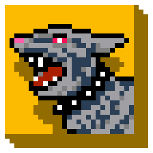

# watchdog-safety-app

Watchdog is an app that attempts to detect when the user is in distress or under attack, then report the incident and/or scare away the attacker.

This project is a HackISU Fall 2019 project put together by Walter Svenddal, Jesrik Gomez, Karla Montoya, and Arnoldo Montoya.